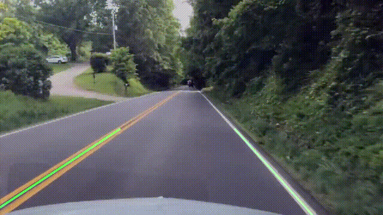
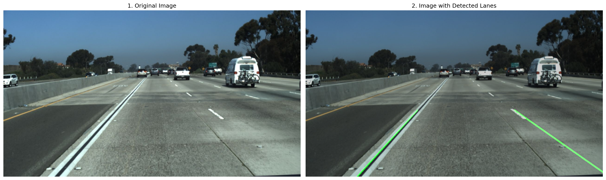
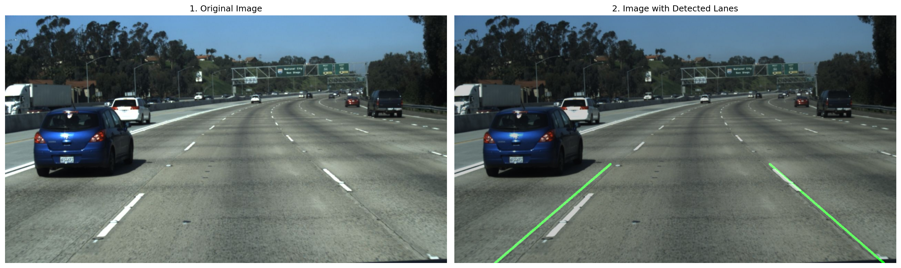
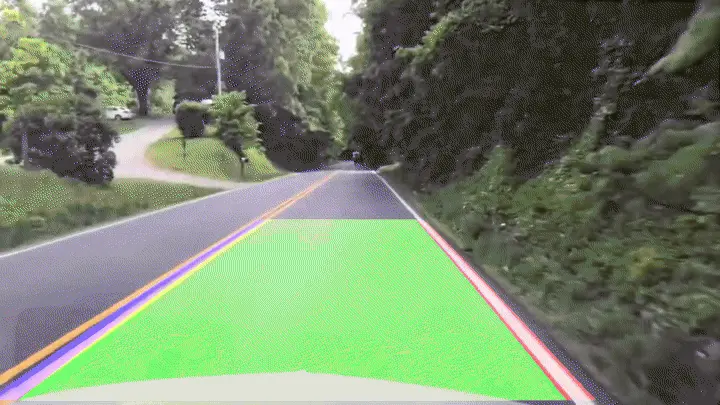
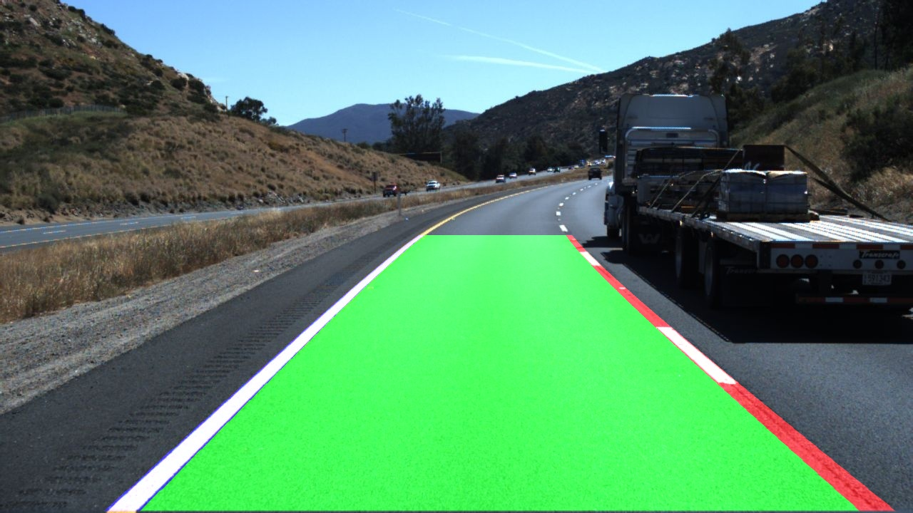
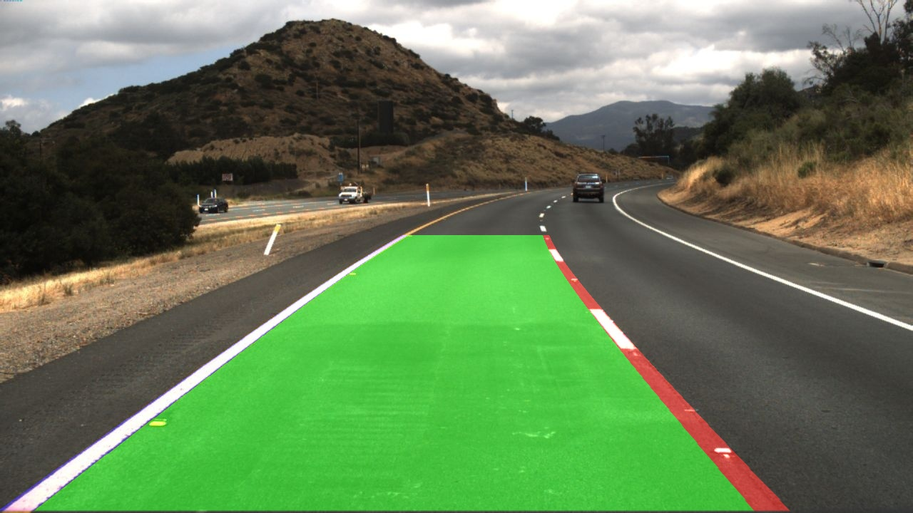

# Lane Detection using Classical Computer Vision

This repository contains two lane-detection pipelines built with OpenCV and NumPy:

- a Hough-transform pipeline for straight-line lane estimation
- a bird's-eye sliding-window pipeline for curved-lane fitting with polynomial models

## Demo

### Hough Pipeline Results
<p align="center">
  
</p>

### Hough Pipeline Visualizations
<p align="center">
  
  <br>
  
</p>

### Sliding Window Pipeline Results
<p align="center">
  
</p>

### Sliding Window Visualizations
<p align="center">
  
  <br>
  
</p>

## Project Structure

```text
hough_lines_pipeline/
  main.py
  visualize.py
  hs_utils.py

sliding_window_pipeline/
  process_frame.py
  process_video.py
  sliding_window.py
  sw_utils.py
  tune_thresholds.py

utils/
  utils.py
```

## Pipelines

### 1. Hough Lines Pipeline

This pipeline targets simpler road geometry where lane boundaries can be approximated as straight lines.

Processing steps:

1. HSL color filtering to isolate white and yellow lane markings
2. Gaussian blur to suppress small noise
3. Canny edge detection
4. Region-of-interest masking
5. Probabilistic Hough transform
6. Slope-based left/right line separation
7. Temporal smoothing using previous detected line fits
8. Final overlay on the original frame

Strengths:

- simple and fast
- easy to inspect and debug
- works reasonably well on straight highway footage

Limitations:

- assumes approximately straight lane boundaries
- degrades on curves, heavy shadows, worn paint, and strong glare
- sensitive to ROI and edge-threshold tuning

### 2. Sliding Window Pipeline

This pipeline warps the road into a bird's-eye view and fits second-order polynomials to lane pixels.

Processing steps:

1. HSL color filtering to build a binary lane mask
2. Perspective transform into top-down view
3. Histogram search in the lower half of the warped image
4. Sliding-window search for left and right lane pixels
5. Quadratic polynomial fitting with `np.polyfit`
6. Lane-area fill and polyline drawing in warped space
7. Inverse perspective transform back to camera view
8. Overlay on the original frame

Current robustness features:

- fallback to the previous known lane fit when a side disappears
- synthetic opposite-lane estimate only when that side has no history yet
- histogram search cropped away from the outer image margins to avoid shoulder or boundary lines
- live threshold tuning with OpenCV sliders

Strengths:

- handles curved lanes better than the Hough approach
- produces a filled lane area, not just two lines
- more stable frame-to-frame once the lane fit is established

Limitations:

- still sensitive to bad thresholding under glare, shadow, and reflections
- perspective points are scene-specific and currently set manually
- can be pulled off target if the binary mask contains large false-positive road regions

## Requirements

```bash
pip install -r requirements.txt
```

If you are not using the provided `requirements.txt`, install at least:

```bash
pip install opencv-python numpy
```

## How to Run

The scripts use local imports and relative asset paths, so run them from the corresponding pipeline directory.

### Hough Lines Pipeline

Run the default video processor:

```bash
cd hough_lines_pipeline
PYTHONPATH=.. python3 main.py
```

Generate the pipeline visualization for a sample image:

```bash
cd hough_lines_pipeline
PYTHONPATH=.. python3 visualize.py
```

Notes:

- `main.py` currently processes `../test_videos/test4.mp4`
- output video path is currently set inside `hough_lines_pipeline/main.py`
- adjust input/output paths directly in the script if you want a different file

### Sliding Window Pipeline

Process an image:

```bash
cd sliding_window_pipeline
PYTHONPATH=.. python3 process_frame.py
```

Process a video:

```bash
cd sliding_window_pipeline
PYTHONPATH=.. python3 process_video.py
```

Tune threshold parameters live with OpenCV sliders:

```bash
cd sliding_window_pipeline
PYTHONPATH=.. python3 tune_thresholds.py
```

Notes:

- `process_video.py` currently reads `../test_videos/test2.mp4`
- `tune_thresholds.py` also targets `../test_videos/test2.mp4` by default
- perspective source points are hardcoded per scene in the scripts and should be adjusted for new camera setups

## Threshold Tuning

The sliding-window tuner exposes these controls:

- `white_l_min`
- `white_s_max`
- `yellow_h_min`
- `yellow_h_max`
- `yellow_l_min`
- `yellow_s_min`
- `blur_kernel`
- `open_kernel`
- `close_kernel`

What they do:

- `blur_kernel`: smooths noise before thresholding
- `open_kernel`: removes small bright blobs after thresholding
- `close_kernel`: reconnects broken lane regions after thresholding

Tuner controls:

- `Space`: pause/resume video
- `R`: reset sliders
- `Esc`: quit

## Dataset / Inputs

The repository currently includes:

- sample TuSimple image folders under `test_images/tusimple/`
- sample videos under `test_videos/`

## Current Focus

This project is focused on building and comparing robust classical-computer-vision lane detectors, understanding their failure modes, and improving them with better masking, geometry constraints, and temporal stabilization.

## Next Improvements

- add gradient-based filtering to complement pure color thresholding
- constrain histogram search using previous lane positions more aggressively
- reduce false positives from sunlight, shadows, and bright road texture
- make input paths and perspective points configurable from the command line
